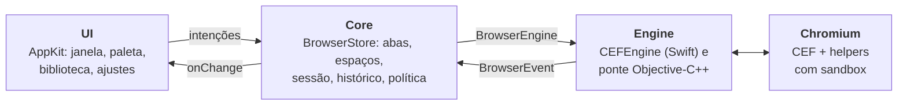

<p align="center">
  
</p>

<h1 align="center">Lume</h1>

<p align="center">
  <strong>Um navegador minimalista e nativo para macOS.</strong><br>
  Interface em Swift e AppKit, páginas renderizadas pelo Chromium via CEF.
</p>

<p align="center">
  
  
  
  
  
  
</p>

<p align="center">
  <a href="#recursos">Recursos</a> ·
  <a href="#começando">Começando</a> ·
  <a href="#atalhos">Atalhos</a> ·
  <a href="#testes">Testes</a> ·
  <a href="#arquitetura">Arquitetura</a> ·
  <a href="#limitações">Limitações</a>
</p>

---

## Por que o Lume

- **Nativo de verdade.** Janela, barra lateral, paleta de comandos e preferências são AppKit. Nada de Electron ou React.
- **Chromium completo.** O CEF traz o motor, o modelo multiprocesso e a sandbox do Chromium, com helpers dedicados.
- **Memória sob seu controle.** Abas podem ser descartadas de verdade, liberando a instância da página. O descarte automático é opcional e começa desligado.
- **Local por padrão.** Sessão, histórico e favoritos ficam neste Mac. Sem telemetria, sem conta, sem IA ativa.

## Recursos

| Área | O que já funciona |
| :-- | :-- |
| **Navegação** | URLs HTTP/HTTPS e busca na mesma barra. `localhost` usa HTTP. Protocolos perigosos (`javascript:`, `data:`, `file:`) são recusados |
| **Abas e espaços** | Espaços de trabalho, abas fixadas, som por aba, reabertura das últimas 25 abas fechadas |
| **Biblioteca** | Histórico pesquisável (ignora acentos), favoritos e downloads com progresso, cancelamento e "Mostrar no Finder" |
| **Página** | Busca com contagem de resultados, zoom de 25% a 500% por aba, impressão nativa e visualizador de PDF |
| **Comandos** | Paleta `⌘K` para executar ações, trocar de aba ou de espaço e abrir endereços |
| **Aparência** | Temas sistema, claro e escuro |
| **Recuperação** | Cópia anterior validada dos dados locais, recuperação de JSON corrompido e recarga após falha do renderer |
| **Memória** | Descarte manual ou automático que preserva a aba ativa, abas carregando e, por padrão, as fixadas |
| **Ferramentas** | DevTools do Chromium em janela própria |

## Começando

### Requisitos

- Mac com **Apple Silicon**, em ARM64 nativo. Intel e Rosetta não são suportados.
- **macOS 14** ou posterior.
- Command Line Tools da Apple (`xcode-select --install`). Não é preciso um projeto Xcode.
- **Python 3.12+** com `venv` e `pip`, e internet no primeiro bootstrap.

### Build

```sh
./scripts/bootstrap.sh   # baixa o CEF fixado, confere o checksum e instala o CMake localmente
./scripts/build.sh       # compila ponte, helpers e app, empacota e assina dist/Lume.app
```

O bootstrap não instala nada globalmente: o CEF vai para `vendor/` e o CMake para `.tools/`. Para limitar o paralelismo, use `LUME_BUILD_JOBS=4 ./scripts/build.sh`.

### Executar

```sh
./scripts/run.sh
```

Para testar sem tocar na sua sessão habitual, use um perfil isolado (caminho absoluto):

```sh
LUME_PROFILE_DIR="$(mktemp -d /tmp/lume-profile.XXXXXX)" ./dist/Lume.app/Contents/MacOS/Lume
```

> [!NOTE]
> Não abra duas instâncias sobre o mesmo diretório de perfil.

## Atalhos

| Atalho | Ação |
| :-- | :-- |
| `⌘L` | Focar a barra de endereço |
| `⌘T` · `⌘W` · `⌘⇧T` | Nova aba · fechar aba · reabrir aba fechada |
| `⌘⇧]` · `⌘⇧[` | Próxima aba · aba anterior |
| `⌘[` · `⌘]` · `⌘R` | Voltar · avançar · recarregar |
| `⌘F` · `⌘G` · `⌘⇧G` · `Esc` | Buscar na página · próximo · anterior · fechar busca |
| `⌘+` · `⌘-` · `⌘0` | Ampliar · reduzir · tamanho real |
| `⌘D` | Adicionar ou remover favorito |
| `⌘Y` · `⌘⇧B` · `⌘⇧J` | Histórico · favoritos · downloads |
| `⌘K` | Paleta de comandos |
| `⌘⇧S` · `⌘⇧D` | Barra lateral · alternar tema |
| `⌥⌘I` · `⌘P` · `⌘,` | DevTools · imprimir · ajustes |

## Testes

```sh
./scripts/test.sh               # contratos do core com engine falsa, sem abrir o CEF
./scripts/smoke.sh              # app real contra fixtures HTTP locais
python3 scripts/reliability.py  # reinício, persistência e recuperação após SIGKILL
```

| Suíte | Cobre |
| :-- | :-- |
| `test.sh` | Normalização de URLs, ciclo de vida e descarte, fechamento assíncrono e `beforeunload`, sessão, migração, biblioteca, busca, zoom, popups e downloads |
| `smoke.sh` | Renderização real, voltar e avançar, múltiplas abas, descarte confirmado pelo motor, recriação, espaços e temas. Relatório em `.build/smoke-report.json` |
| `reliability.py` | Cookie HttpOnly e `localStorage` após reinício, busca e zoom reais, falha de rede, crash do renderer, WebRTC sintético e recuperação após SIGKILL. Relatório em `.build/reliability-report.json` |

Todos os testes de integração usam perfis temporários e um servidor de fixtures em `127.0.0.1`. As APIs de diagnóstico só existem com a flag de teste e a origem loopback configurada.

## Arquitetura



- **Core não conhece o CEF.** O contrato `BrowserEngine` expõe criação de views, navegação, histórico, áudio, busca, zoom, impressão e downloads. Os eventos voltam como `BrowserEvent`.
- **Tipos do Chromium não atravessam a ponte.** `CefRefPtr`, handlers e detalhes de processo ficam em Objective-C++; o Swift só enxerga Foundation e AppKit.
- **Criar e fechar páginas é assíncrono.** Uma aba só é removida ou descartada depois que o motor confirma o fechamento, respeitando diálogos `beforeunload`.
- **Um único loop principal.** `CefRunMessageLoop` roda na thread principal integrado ao `NSApplication`.

### Ciclo de vida das abas

| Estado | Significado |
| :-- | :-- |
| `active` | Aba selecionada, com página residente |
| `warm` | Página residente em segundo plano; scripts continuam rodando |
| `discarded` | Sem página residente; a URL recarrega ao selecionar |
| `frozen` | Reservado; o motor atual não congela páginas |

### Estrutura do projeto

```text
src/
├── App/        entrada, composição e checagens de integração
├── Core/       estado, navegação, sessão, comandos e política de memória
├── Engine/     adapter Swift, ponte Objective-C++ e helper do CEF
└── UI/         janela e controles AppKit
tests/          testes do core e fixtures HTTP
scripts/        bootstrap, build, empacotamento, testes e ícone
resources/      ícone do app e entitlements
cef-version.json  versão e checksum fixados do CEF
```

## Dados locais e privacidade

Tudo fica em `~/Library/Application Support/Lume`:

| Arquivo | Conteúdo |
| :-- | :-- |
| `session.json` | Abas, espaços, seleção e abas fechadas recentemente |
| `settings.json` | Tema, barra lateral, busca e política de memória |
| `library.json` | Histórico, favoritos e registros de downloads |
| `Chromium/` | Perfil do motor: cookies, cache e `chromium.log` |

Os JSONs são gravados com substituição atômica e permissão `0600`, com uma cópia `.backup.json` validada. Eles contêm URLs e títulos em texto legível e não são criptografados. Limpar o histórico também o remove das cópias de recuperação. A busca padrão é o DuckDuckGo.

## Limitações

> [!IMPORTANT]
> O Lume é experimental. Não há distribuição pública: o build gera um app local com assinatura ad hoc e hardened runtime, sem Developer ID nem notarização.

- **Descartar uma aba recarrega a página.** DOM, formulários não salvos e o histórico voltar/avançar daquela instância se perdem.
- **Sem congelamento de páginas.** O estado `frozen` existe no modelo, mas o motor não o suporta.
- **Sem extensões do Chrome** e sem integração de IA; existe apenas o contrato para uma decisão futura.
- **Espaços não isolam identidade.** Todos compartilham cookies e armazenamento.
- **Economia de memória não medida.** Contar abas descartadas não comprova RAM ou bateria economizadas.

Validado em um Apple M1 com 8 GB de RAM.

## Ícone

O ícone é composto no Icon Composer a partir das camadas vetoriais em `resources/AppIcon` e exportado para `Lume.icns`, que o build usa diretamente. Para regenerar depois de alterar a arte:

```sh
python3 scripts/build-icon.py   # requer o Icon Composer da Apple
python3 scripts/package.py
```

## Licença

Este repositório ainda não declara uma licença própria. O CEF e o Chromium incluem componentes de terceiros; o empacotamento copia a licença do CEF para `Contents/Resources/CEF-LICENSE.txt`.
